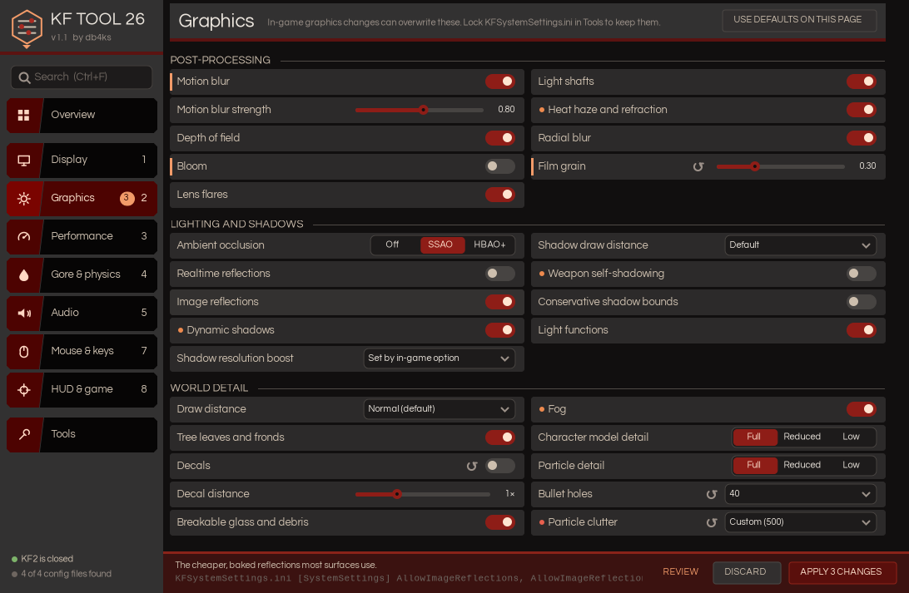
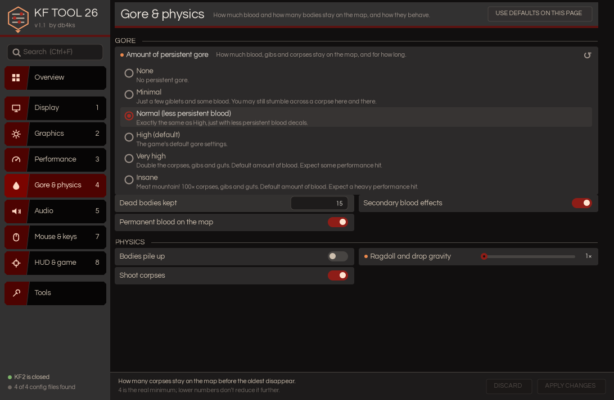
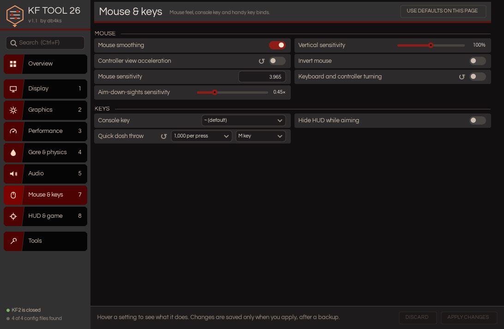

# KF TOOL 26

**A small, portable settings tool for Killing Floor 2.** Change the settings you'd normally have to dig through `.ini` files to find, with a few clicks, and with a backup made before anything is saved.



## At a glance

| | |
|---|---|
| **Size** | 384 KB, a single `.exe` |
| **Install** | None. No installer, no setup wizard, no admin rights. Download, double-click, done. |
| **Settings** | 96, covering 150 keys across 4 config files |
| **Needs** | Windows 10 or 11 (uses the .NET Framework that already comes with Windows) |
| **Version** | 1.1 |
| **Author** | db4ks |

## What it is

KF TOOL 26 edits Killing Floor 2's own config files (`KFEngine.ini`, `KFGame.ini`, `KFInput.ini` and `KFSystemSettings.ini`) for you. It's a modern rebuild of the classic [KF2 Tweaker by RejZoR](https://rejzor.wordpress.com/killing-floor-2-tweaker/). It keeps the most useful tweaks (gore levels, draw distance, texture streaming, dosh throwing, intro skip) and adds a lot more, all in one window with a KF2-style look.

## What's better than KF2 Tweaker

- **Smaller and instant.** 384 KB against the original's 489 KB, and it opens straight away instead of unpacking a setup engine into your temp folder each time.
- **No installer, no wizard.** Every setting is in one window with a search box, instead of clicking through one screen at a time.
- **Nothing is saved until you press Apply.** Change settings, review them, or discard them all.
- **Automatic backups.** Every Apply backs up your config files first. The last 30 are kept, and you can restore any of them from the Tools page.
- **Careful edits.** Only the lines being changed are touched. Your comments, ordering and file formatting stay exactly as they were.
- **Every setting explains itself.** Hover over one to see what it does, any warning, and the exact file and key it edits.
- **Bug fixes.**
  - "Clear download cache" pointed at a hardcoded `D:` drive path. It now uses your real folder.
  - The old "mouse movement scale" option actually switched off keyboard and controller turning. KF TOOL 26 spots this and offers a one-click fix.
  - The frame rate limit now sets both files the game reads.
- **Safer.** Warns you if KF2 is running (it rewrites its config when it closes), finds your config folder automatically (OneDrive Documents included), and lets you pick it yourself if needed.
- **Compact.** A two-column layout keeps every page on one screen, so there's no scrolling.

## Extra features

| Page | Highlights |
|---|---|
| **Display** (9) | FOV in fine steps, a wider "Hor+" view for widescreen, frame rate limit up to 500 or uncapped, render scale, V-sync, display mode, resolution, texture filtering |
| **Graphics** (28) | Motion blur, depth of field, bloom, lens flares, film grain, heat haze, light shafts, ambient occlusion, reflections, shadow quality and distance, draw distance, decals, bullet holes, particle clutter, fog, model detail |
| **Performance** (23) | Texture streaming and memory pool, frame pacing, tick rate for solo and hosted games, PhysX memory, modded-server crash fix, low-end options |
| **Gore & physics** (7) | Six gore levels from None to Insane, dead body count, blood on the map, bodies piling up, ragdoll gravity |
| **Audio** (8) | Sound channels and memory, voice chat options for hosts, mute when in the background |
| **Mouse & keys** (10) | Mouse smoothing, exact sensitivity, aim-down-sights sensitivity, console key for non-US keyboards, one-press dosh throw (on a key or the mouse wheel), hide the HUD while aiming |
| **HUD & game** (11) | Crosshair, teammate info size, trader path, chat lines, see every teammate's flashlight, skip intro and loading videos |
| **Overview** | Four one-click presets (Clear picture, More FPS, Low-end rescue, High-end extras) and a "Worth a look" list that flags common problems |
| **Tools** | Backup and restore, lock config files so the game can't overwrite them, key-binding copy, clear download cache, copy the `-nostartupmovies` launch option, launch the game, reset all game settings |

## How it works

1. **Open it.** It finds your config folder on its own (`Documents\My Games\KillingFloor2\KFGame\Config`). If it can't, start KF2 once so the game creates its files, or choose the folder yourself.
2. **Change settings.** Use the tabs, or press `Ctrl+F` and search by name or by problem, like "stutter".
3. **Review.** Changed settings get a marker, the tab shows a count, and the bottom bar turns red. Click **Review** to see everything waiting to be saved.
4. **Apply.** A backup is made, then only the changed lines are written. **Discard** throws the changes away instead.

Close Killing Floor 2 before applying, because the game rewrites its config files when it exits. The small arrow next to a setting puts it back to its default.

## Why it's useful

- Cap or uncap your frame rate, widen your FOV or cut stutter without opening Notepad.
- No more hunting for one key among thousands of lines across four files.
- Presets make it quick to tune for a low-end PC or a high-end one.
- You can experiment freely, because every change is backed up and can be restored.
- Hosts get controls for voice chat and tick rate, and everyone gets the popular modded-server crash fix.

## Getting started

1. Download `KF TOOL 26.exe` from the [Releases](../../releases) page.
2. Double-click it.

The exe isn't code-signed, so Windows SmartScreen may warn you the first time. Click **More info**, then **Run anyway**.

To remove it, delete the file. It only keeps its own settings and backups in `%LOCALAPPDATA%\KF TOOL 26`.

## Build from source

Double-click `build.bat`. It uses the C# compiler that's already part of Windows, so there's nothing to install.

Or, with Mono on Linux or macOS:

```
mcs -sdk:4.5 -target:winexe -optimize+ -win32icon:app.ico -resource:fonts/Questrial-Regular.ttf,Questrial.ttf -out:"KF TOOL 26.exe" -r:System.Windows.Forms.dll -r:System.Drawing.dll src/*.cs
```

To add a setting, add one entry to `src/Catalog.cs`: the file, section, key, values and description.

## Good to know

- It only edits config files in your Documents folder. It doesn't touch game files or run inside the game.
- Changing graphics in the game's own menu can overwrite some tweaks. Lock the file on the Tools page to keep them.
- The voice chat settings are host settings: they apply to solo games and servers you host, not other people's servers.
- Settings marked with an orange dot have a warning. Hover over them to read it.
- Use at your own risk. Backups are automatic, but keep your own copy of anything you care about.
- KF TOOL 26 was built and tested on Linux using Mono. It's a standard Windows Forms app and should behave the same on Windows. If you hit anything odd, please open an issue.

## Credits

- The original [KF2 Tweaker](https://rejzor.wordpress.com/killing-floor-2-tweaker/) by RejZoR. KF TOOL 26 is an independent rewrite and isn't affiliated with RejZoR.
- Font: [Questrial](https://github.com/googlefonts/questrial), used under the SIL Open Font License (see `fonts/OFL.txt`).
- Killing Floor is a trademark of Tripwire Interactive. This project isn't affiliated with or endorsed by Tripwire Interactive.

## More screenshots




